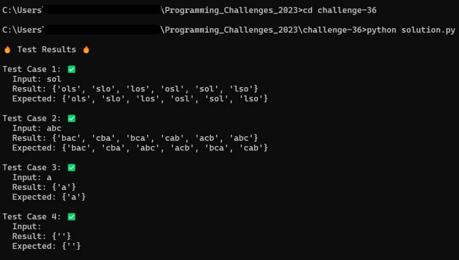

<center><h1>PERMUTACIONES</h1></center>

```javascript 
/*
 * Crea un programa que sea capaz de generar e imprimir todas las 
 * permutaciones disponibles formadas por las letras de una palabra.
 * - Las palabras generadas no tienen por qué existir.
 * - Deben usarse todas las letras en cada permutación.
 * - Ejemplo: sol, slo, ols, osl, los, lso 
 */
```


<center>
    
</center>