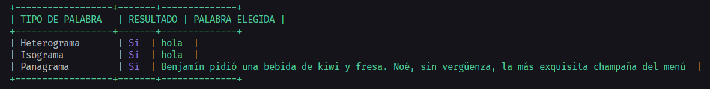

# HETEROGRAMA, ISOGRAMA Y PANGRAMA

```javascript	
/*
 * Crea 3 funciones, cada una encargada de detectar si una cadena de
 * texto es un heterograma, un isograma o un pangrama.
 * - Debes buscar la definición de cada uno de estos términos.
 */
```

####  PANAGRAMA = Benjamín pidió una bebida de kiwi y fresa. Noé, sin vergüenza, la más exquisita champaña del menú
####  HETEROGRAMA = Yuxtaponer, Centrifugado, Luteranismo
####  ISOGRAMA = Acondicionar, Escritura, Intestinos

// put image here in middle

<center>
    
</center>